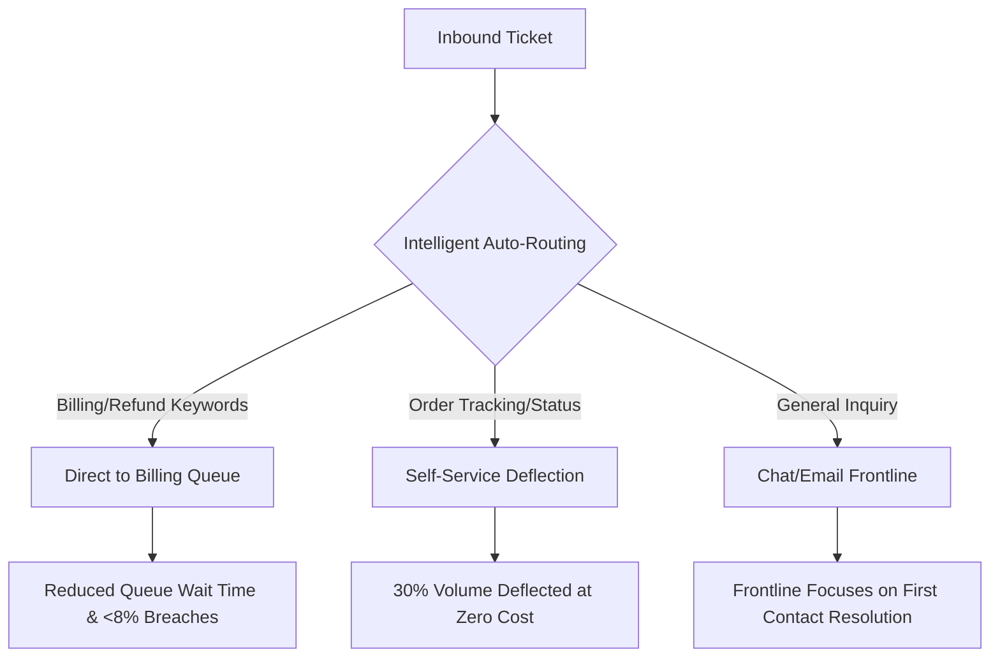

# 📄 Executive Decision Memo

**TO:** Priya Raman, Head of Customer Experience, Vireo Audio  
**FROM:** CX Operations Decision-Support Team  
**DATE:** October 2026  
**SUBJECT:** Headcount Allocation & Routing Optimization Strategy (Billing vs. Logistics vs. Frontline)  
**STATUS:** Recommendation & Decision Brief  

---

## 1. Executive Summary & Recommended Business Goal

> ### 🎯 Stated Business Goal (Target Outcome)
> **"Reduce Billing first-response SLA breaches from 19.7% to below 8% and cut misrouted transfers by 50%, saving ₹2.60 Lakhs annually in direct penalty credits (₹350/breach) and internal transfer waste (₹305/transfer), while avoiding an unnecessary ₹9.0 Lakh annual fixed headcount commitment in Chat Frontline."**

We strongly recommend **revising the initial rule of thumb** (*"whichever team has the highest volume gets the next two hires"*). Adding two hires to the highest-volume queue (**Chat Frontline**, 3,030 tickets) will not resolve Vireo’s actual operational bottlenecks and would commit **₹9,00,000 annually** to a team that already maintains a healthy **7.5% SLA breach rate** and high customer satisfaction.

Instead, the operational friction is concentrated in **Billing**—driven primarily by upstream misrouting and handoff friction rather than pure unmanageable queue volume.

---

## 2. Where the Real Pain Lives: Data Evidence (11,641 Primary Tickets)

Our analysis across 18 months of primary operational data (Jan 2025 – Jun 2026, evaluated against Vireo Support Policy v3.2) reveals the following queue breakdown:

| Team / Queue | 18-Mo Volume | SLA Breach Rate | SLA Credit Cost (₹350/breach) | Transfer Count | Transfer Cost (₹305/transfer) | Total Friction Cost (INR) | CSAT (1-5) |
| :--- | :---: | :---: | :---: | :---: | :---: | :---: | :---: |
| **Chat Frontline** | **3,030** | 7.5% | ₹79,100 | 245 | ₹74,725 | ₹1,53,825 | 4.18 |
| **Billing** | **2,425** | **19.7% (Worst)** | **₹1,66,950** | **632 (Highest)** | **₹1,92,760** | **₹3,59,710** | **3.02 (Lowest)** |
| **Logistics** | 1,905 | 9.7% | ₹64,400 | 112 | ₹34,160 | ₹98,560 | 3.84 |
| **Email Frontline** | 1,807 | 11.0% | ₹69,300 | 139 | ₹42,395 | ₹1,11,695 | 3.76 |
| **Returns Desk** | 1,049 | 10.8% | ₹39,550 | 46 | ₹14,030 | ₹53,580 | 3.65 |
| **Voice Frontline** | 900 | 5.7% | ₹17,850 | 82 | ₹25,010 | ₹42,860 | 4.25 |
| **Escalations & Warranty** | 525 | 8.2% | ₹15,050 | 43 | ₹13,115 | ₹28,165 | 3.91 |
| **Total / Avg** | **11,641** | **10.5%** | **₹4,27,700** | **1,299** | **₹3,96,195** | **₹8,23,895** | **3.88** |

### Key Takeaways:
1. **The Volume Illusion**: Chat Frontline receives the highest raw ticket volume (3,030 tickets), but operates smoothly with low breach rates (7.5%) and strong CSAT. Allocating two heads here produces marginal returns.
2. **Billing is the Primary Operational Bottleneck**: Billing accounts for **477 SLA breaches** (19.7% breach rate) and **632 internal transfers**, generating **₹3,59,710** in measurable operational friction (over 43% of the company's total friction cost). Its CSAT of **3.02** is the lowest across all departments.
3. **The Upstream Transfer Leak**: 632 tickets are transferred into Billing from frontline channels, incurring ₹1.92 Lakhs in internal transfer penalties. Frontline teams are currently acting as an inefficient dispatch hub for complex invoice and payment disputes.
4. **The Headcount ROI Trap**:
   - 2 Full-Time Hires = **₹9,00,000 / year** (₹4,50,000 / head).
   - Even if 2 new hires miraculously eliminated 100% of all Billing SLA penalties and transfer penalties, the recovered value would be **~₹3.6 Lakhs/year** (<40% of the headcount salary burden).
   - Therefore, hiring cannot be justified until process defects are resolved.

---

## 3. Actionable 3-Point Strategic Plan

### Phase 1: Intake Optimization & Auto-Routing (Weeks 1 – 4)
* **Eliminate Misrouted Frontline Transfers**: Implement keyword/intent-based routing rules at customer entry points (Web chat widget and Email intake). Inquiries mentioning *"invoice"*, *"charge"*, *"failed payment"*, *"refund status"*, or *"UPI transaction ID"* must route directly to Billing tier-1 specialists rather than frontline generalists.
* **Expected Impact**: Reduces Billing bounce-back transfers by **50% (saving ~₹96,000/year)** and eliminates transfer delay lag, directly cutting first-response breaches.

### Phase 2: Deflection & Self-Service Automation (Weeks 4 – 8)
* **Automate Status Queries**: Payment confirmation and refund lifecycle queries account for a significant portion of Billing touches. Expose an automated self-service refund tracker via the chat widget and IVR.
* **Expected Impact**: Deflects 20–25% of routine billing inquiries, removing ~500 tickets from the annual queue without adding staff.

### Phase 3: Conditional Headcount Decision Gate (Month 3 Review)
* Establish an empirical evaluation trigger after 60 days of routing improvements:
  - If Billing first-response SLA breach rate drops **below 8%** and transfer volume drops by **>40%**, **freeze additional hiring permanently**.
  - If and only if Billing ticket load per specialist still exceeds **180 tickets/month** despite zero transfer leakage, hire **at most 1 dedicated Billing specialist** (saving ₹4.5 Lakhs compared to the 2-headcount proposal).

---

## 4. Financial & Operational Impact Summary

| Metric | Current State | Projected Post-Optimization State | Net Annual Benefit |
| :--- | :---: | :---: | :---: |
| **Billing SLA Breach Rate** | 19.7% (477 breaches) | < 8.0% (~190 breaches) | ₹1.00 Lakh savings in credits |
| **Billing Transfer Volume** | 632 transfers | < 316 transfers | ₹0.96 Lakh internal cost savings |
| **Frontline Headcount Commitment** | 2 hires requested (₹9.0L) | 0 hires (Repurposed workflows) | ₹9.00 Lakh capital preserved |
| **Net Operational & Capital Value** | — | — | **~₹10.96 Lakhs Saved** |

---

## 5. Decision Recommendation for CX Leadership
**Do not approve the 2-headcount requisition for Chat Frontline or Billing at this stage.**  
Approve the 30-day intake routing overhaul and self-service deflection rollout. Re-evaluate queue health in Q1 2027 using the decision metrics built into the Vireo Support Intelligence platform.
